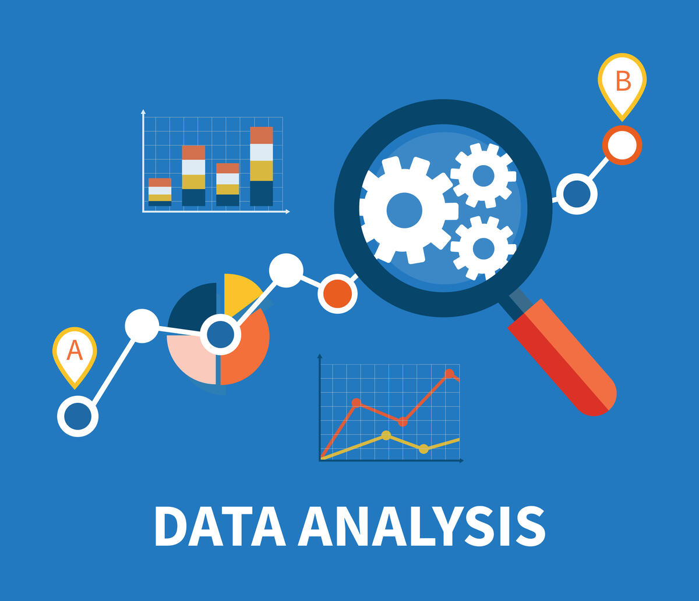

  
  <h1 align="center">Cheat Sheet for Data Analyst</h1>

## About The File

This file is a summary of what was learned in Redi School. It covers most topics related to data analysis. But with the daily development in this field, it is possible to add, reduce or change some of the content. All wishes that everyone who begins to learn data analysis will benefit from this humble summary.

## Table of Contents

* Import Packages and Libraries
* Read the Dataset
* Inspecting the Data Frame
* Sort the Rows in the Data Frame
* Explicit Indexes
* Slicing and Subsetting
* Visualizing the Data
* Data Visualization using Seaborn
* Missing Values
* Important Defentions
* Grouped Summary Statistics
* Selecting Data with Query

## Roadmap

* [X] Identify the most important topics in data analysis
* [ ] More detailed explanations of some important terms
* [ ] Add images to explain how to visualize the data
* [ ] More clarification to determine the purpose of using any plot in any case of **Model Bucket**
* [ ] Mention the data analyst responsibilities
